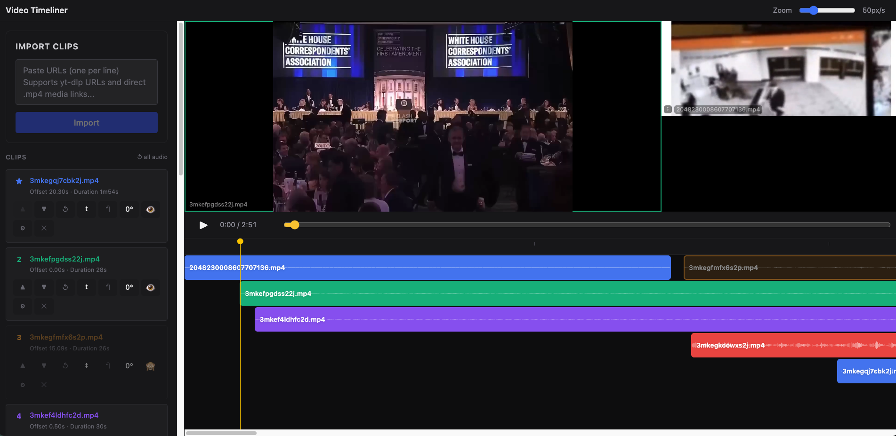

# Video Timeliner



Local web app for importing social video clips, aligning them on a shared timeline, and rendering a synchronized multi-clip output video.

## Beginner Setup

You need three things installed before the app can run:

- Node.js 20 or newer
- FFmpeg, which also includes `ffprobe`
- `yt-dlp`, used to download videos from supported URLs

### 1. Install Node.js

Download and install the current LTS version from:

https://nodejs.org/

After installing it, open a terminal and check:

```bash
node --version
npm --version
```

### 2. Install FFmpeg and yt-dlp

macOS with Homebrew:

```bash
brew install ffmpeg yt-dlp
```

Windows with winget, in PowerShell:

```powershell
winget install Gyan.FFmpeg
winget install yt-dlp.yt-dlp
```

Linux, example for Ubuntu/Debian:

```bash
sudo apt update
sudo apt install ffmpeg
```

Then install `yt-dlp` via your package manager or from the official yt-dlp releases.

Check that the tools are available:

```bash
ffmpeg -version
ffprobe -version
yt-dlp --version
```

If the tools are not on `PATH`, set `FFMPEG_PATH`, `FFPROBE_PATH`, and `YTDLP_PATH`.

### 3. Download the app

Option A, with Git:

```bash
git clone https://github.com/CHesseling/video_timeliner.git
cd video_timeliner
```

Option B, without Git:

1. Open https://github.com/CHesseling/video_timeliner
2. Click `Code`
3. Click `Download ZIP`
4. Unzip the file
5. Open a terminal in the unzipped folder

### 4. Install the app dependencies

```bash
npm install
```

### 5. Start the app

```bash
npm run dev
```

Then open this address in your browser:

http://localhost:5173

The backend server runs on:

http://localhost:3001

### 6. Stop the app

Go back to the terminal and press `Ctrl+C`.

## Local Data

Local project data, imported media, waveform caches, and render output are stored in `server/data/` by default. Override with `VIDEO_TIMELINER_DATA_DIR` if needed.
